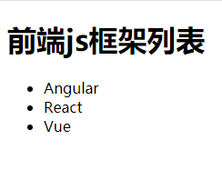

## react入门 
### 一、react 简介
#### 1. 官网
* 英文官网: https://reactjs.org/
* 中文官网: https://react.docschina.org/
#### 2. 介绍
* 用于动态构建用户界面的 JavaScript 库(只关注于视图)
* 是一个将数据渲染为HTML视图的开源JS库
* 由Facebook开源
#### 3. 为什么学react
* 原生JS操作DOM繁琐，效率低
* 使用JS直接操作DOM,浏览器会进行大量的重绘重排
* 原生JS没有组件化编码方案，代码复用低
#### 4. React的特点
* 声明式编码
* 组件化编码
* React Native 编写原生应用
* 高效（优秀的Diffi
* ng算法）
#### 5.React高效的原因
* 使用虚拟(virtual)DOM, 不总是直接操作页面真实DOM。
* DOM Diffing算法, 最小化页面重绘
### 二、react简单使用
#### 1. 开发依赖核心库
* react.js：React核心库。
* react-dom.js：提供操作DOM的react扩展库。
* babel.min.js：解析JSX语法代码转为JS代码的库
#### 2. 简单使用
* 先创建一个容器
* script标签引入开发依赖核心库
* 编写jsx代码： 创建虚拟dom， 渲染虚拟dom到容器中中
#### 3. 创建虚拟DOM的两种方式
##### 1. 使用js创建虚拟DOM：React.createElement(标签,标签属性,内容)
    ```js
    const VDOM = React.createElement('h1', {id: 'title'}, React.createElement('span', {}, 'Hello, React'));
    ```
##### 2. 使用jsx创建虚拟DOM
    ```js
    const VDOM = ( // jsx语法结构更清晰
       <h1 id='title'>
        <span>Hello, React</span>
       </h1>
       
    ```
##### 比较： 标签比较多且有嵌套的情况下用jsx创建，js创建过于繁琐
#### 4. 渲染虚拟DOM(元素)
* 语法:  ReactDOM.render(virtualDOM, containerDOM)
* 作用: 将虚拟DOM元素渲染到页面中的真实容器DOM中显示
* 参数说明
  参数一: 纯js或jsx创建的虚拟dom对象
  参数二: 用来包含虚拟DOM元素的真实dom元素对象(一般是一个div)
#### 5. 真实DOM与虚拟DOM
* 虚拟DOM的本质就是Object类型的一般对象
* 真实DOM是元素标签
### 三、jsx
#### 1. jsx简介
* 全称:  JavaScript XML
* react定义的一种类似于XML的JS扩展语法: JS + XML
* 本质是react中用js创建虚拟DOM的语法糖
* 作用: 用来简化创建虚拟DOM
    1)	写法：var ele = <h1>Hello JSX!</h1>
    2)	注意1：它不是字符串, 也不是HTML/XML标签
    3)	注意2：它最终产生的就是一个JS对象
* 标签名任意: HTML标签或其它标签
* 标签属性任意: HTML标签属性或其它
#### 2. jsx语法规则
* 1. 定义虚拟DOM时，不要写引号
* 2. 标签中混入js表达式时要用 {}
* 3. 样式的类名指定不要用class，要用className
* 4. 内联样式,要用style={{key: value, key2: value2}}的形式
*     有些属性要用小驼峰法写，例如 fontSize
* 5. 只有一个根标签
* 6. 标签必须闭合
* 7. 标签名可以随意的编写：
	(1).若标签首字母是【小写】的，则react会尝试将当前的jsx标签转为html中同名元素
					若html中有该元素，直接渲染，展示。
					若html中无该元素，直接报错！
	(2).若标签首字母是【大写】的，则react会查找Haha组件的定义的位置
					若找到了，直接渲染Haha组件
					若未找到，报错(Haha is not defined)
### 四、jsx小练习
* 需求: 动态展示如下列表
  
### 五、模块与组件、模块化与组件化的理解
#### 1. 模块
* 理解：向外提供特定功能的js程序, 一般就是一个js文件
* 为什么要拆成模块：随着业务逻辑增加，代码越来越多且复杂。
* 作用：复用js, 简化js的编写, 提高js运行效率
#### 组件
* 理解：用来实现局部功能效果的代码和资源的集合(html/css/js/image等等)
* 为什么要用组件： 一个界面的功能更复杂
* 作用：复用编码, 简化项目编码, 提高运行效率
#### 模块化
* 当应用的js都以模块来编写的, 这个应用就是一个模块化的应用
#### 组件化
* 当应用是以多组件的方式实现, 这个应用就是一个组件化的应用
### 六、下载不同版本的react
* 打开react中文文档，在CDN连接处直接打开对应链接
* 然后把js文件另存在本地即可
* 如果需要加载指定版本的 react 和 react-dom，可以把官网连接16 替换成所需加载的版本号
#### 其他js文件
* 可以在BootCDN网站下载
