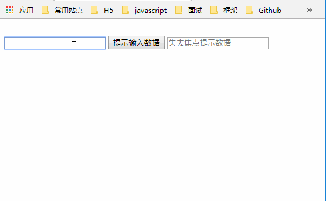

## React面向组件编程
### 一、 基本理解和使用
#### 1. 使用React开发者工具调试(react developer tools)
* 先在极简插件下载了 igg谷歌开发助手插件--- 帮助打开chrome应用商店
* 然后安装了vue-devtools和react developer tools
* 安装后并没有向教程里说的控制台出现对应图标
* 只有在打开了用vue或者react开发的页面时才出现对应图标
#### 2. 组件定义的两种方式
* 1. 使用函数式定义(简单定义)
```js
function MyComponent() {
    console.log(this); // 此处的this是undefined，因为经过babel的编译后，开启了严格模式
    return <h2>我是用函数定义的组件（适用于【简单组件】的定义）</h2>
}
```
* 2. 使用类式定义
```js
class MyComponent extends React.Component {
    render() {
        console.log(this); //MyComponent的实例对象 <==> MyComponent组件实例对象
		return <h2>我是用类定义的组件（适用于【复杂组件】的定义）</h2>
    }
}
```
* 3. 渲染类组件标签的基本流程
1) React内部会创建组件实例对象
2) 调用render()得到虚拟DOM, 并解析为真实DOM
3) 插入到指定的页面元素内部
* 4.解决react开发图标报错问题：在head标签中添加图标
```js
<link rel="shortcut icon" href="../logo/favicon.ico">
```
* 5. 简单组件： 无state(状态)    复杂组件： 有state
#### 3. 类式组件实例三大属性01——state
* 需求: 定义一个展示天气信息的组件
    1.	默认展示天气炎热 或 凉爽
    2.	点击文字切换天气状态
* 3.0 state
  1. state是组件对象最重要的属性, 值是对象(可以包含多个key-value的组合)
  2. 组件被称为"状态机", 通过更新组件的state来更新对应的页面显示(重新渲染组件)
* 3.1 初始化state
```js
// 初始化state  直接赋值
state = {
    isHot: true,
    wind: '微风'
}
```
* 3.2 修改state:状态必须通过setState进行更新,且更新是一种合并，不是替换
```js
this.setState({isHot: !isHot})
```
* 3.3 自定义方法————要用赋值语句的形式+箭头函数
```js
changeWeather = ()=>  {
    const isHot = this.state.isHot
    this.setState({isHot: !isHot})
}
```
* 3.4 绑定事件 
```js
return <h2 onClick={this.changeWeather}>今天天气很{isHot ? '炎热':'凉爽'},{wind}</h2>
```
* 3.5 强烈注意
  1. 组件中render方法中的this为组件实例对象
  2. 组件自定义的方法中this为undefined，如何解决？
    a)	强制绑定this: 通过函数对象的bind()
    b)	箭头函数
  3. 状态数据，不能直接修改或更新
- 
#### 4. 类式组件实例三大属性02——props
* 需求: 自定义用来显示一个人员信息的组件
  1. 姓名必须指定，且为字符串类型；
  2. 性别为字符串类型，如果性别没有指定，默认为男
  3. 年龄为字符串类型，且为数字类型，默认值为18
   如图
* 4.0 props
  1. 每个组件对象都会有props(properties的简写)属性
  2. 组件标签的所有属性都保存在props中
  3. 作用
    1) 通过标签属性从组件外向组件内传递变化的数据
    2) 注意: 组件内部不要修改props数据,props只读
* 4.1 内部读取某个属性值
```js
this.props.name
```
* 4.2 批量传递props
```js
const p = {name:'老刘',age:18,sex:'女'}
// ReactDOM.render(<Person name={p.name} age={p.age} sex={p.sex}/>,document.getElementById('app'))
// 上面语句的语法糖
ReactDOM.render(<Person {...p}/>,document.getElementById('app'))
```
* 4.3 对props进行限制
```js 写在自定义类组件外
 // 1. 对标签属性进行类型、必要性的限制
Person.propTypes = {
    // PropTypes: 外部引入   string： 指定数据类型   isRequired： 是否必传
	name:PropTypes.string.isRequired, // 限制name必传，且为字符串
	sex:PropTypes.string,// 限制sex为字符串
	age:PropTypes.number,// 限制age为数值
	speak:PropTypes.func,// 限制speak为函数  注意这里是func而不是function
}
// 2. 指定默认标签属性值
Person.defaultProps = {
	sex:'男',// sex默认值为男
	age:18 // age默认值为18
}
```
* 4.4 props简写
```js 写在自定义类组件里， 把它们直接添加成为类Person的属性方法
 // 1. 对标签属性进行类型、必要性的限制
static propTypes = {
	name:PropTypes.string.isRequired, //限制name必传，且为字符串
	sex:PropTypes.string,//限制sex为字符串
	age:PropTypes.number,//限制age为数值

// 2. 指定默认标签属性值
static defaultProps = {
	sex:'男',//sex默认值为男
	age:18 //age默认值为18
}
```
* 4.5 constructor与props
  1) 构造器是否接收props，是否传递给super，取决于：是否希望在构造器中通过this访问props
  2) 一般在react中很少使用构造器函数
* 4.6 函数组件使用props
```js
// 创建组件
function Person (props) {
    // 解构
    const {name,age,sex} = props
    return (
			<ul>
				<li>姓名：{name}</li>
				<li>性别：{sex}</li>
				<li>年龄：{age}</li>
			</ul>
		)

// 对标签属性进行类型、必要性的限制
Person.propTypes = {
	name:PropTypes.string.isRequired, //限制name必传，且为字符串
	sex:PropTypes.string,//限制sex为字符串
	age:PropTypes.number,//限制age为数值

//指定默认标签属性值
Person.defaultProps = {
	sex:'男',//sex默认值为男
	age:18 //age默认值为18

// 批量传递props 
const p = {name:'老刘',age:18,sex:'女'}
ReactDOM.render(<Person {...p}/>,document.getElementById('app'))
```
#### 5. 类式组件实例三大属性03——refs：避免过度使用ref
* 需求：自定义组件, 功能说明如下:
  1. 点击按钮, 提示第一个输入框中的值
  2. 当第2个输入框失去焦点时, 提示这个输入框中的值
  3. 效果如图
* 5.0 refs
  组件内的标签可以定义ref属性来标识自己
* 5.1 字符串形式的ref(官方不推荐使用)
```js
// 定义
<input ref="input1" type="text" placeholder="点击按钮提示数据"/>
// 调用
alert(this.refs.input1.value)
```
* 5.2 内联回调函数形式的ref(当前使用多)
  如果 ref 回调函数是以内联函数的方式定义的，在更新过程中(render调用过程)它会被执行两次
```js
// 定义
<input ref={(currentNode) => this.input1 = currentNode} type="text" placeholder="点击按钮提示数据"/>
// 使用
alert(this.input1.value)
```
* 5.3 回调函数形式的ref(和5.2 的区别在于函数外部定义)
```js
// 定义
saveInput = (currentNode)=>{
	this.input1 = currentNode
	console.log('@',currentNode)
}
// 使用
<input ref={this.saveInput} type="text"/>
```
* 5.4 createRef的使用(官方推荐)
```js
// 定义
myRef2 = React.createRef()
// 使用
<input onBlur={this.showData2} ref={this.myRef2} type="text" placeholder="失去焦点提示数据"/>
showData2 = ()=>{
	alert(this.myRef2.current.value);
}
```
#### 6. React中的事件处理
* 6.1 通过onXxx属性指定事件处理函数(注意大小写)
		a.React使用的是自定义(合成)事件, 而不是使用的原生DOM事件 —————— 为了更好的兼容性
		b.React中的事件是通过事件委托方式处理的(委托给组件最外层的元素) ————————为了的高效
* 6.2 通过event.target得到发生事件的DOM元素对象 ——————————不要过度使用ref
      当发生事件的DOM元素对象与事件绑定对象是同一个时，可以使用event.target
#### 7. react手机表单数据
* 7.0 需求: 
  定义一个包含表单的组件输入用户名密码后, 点击登录提示输入信息
  效果如图
* 7.1 非受控组件与受控组件
  非受控组件：与state无关，使用ref获取节点
  ```js
  <form onSubmit={this.handleData}>
       用户名：<input ref={(c) => {this.username = c}} type="text" name="username" />
       密码：<input ref={(c) => {this.password = c}} type="password" name="password" />
       <button>登录</button>
  </form>
  ```
  受控组件：只能使用 setState() 更新数值
  ```js
  <form onSubmit={this.handleData}>
     用户名：<input onChange={this.saveUsername} type="text" name="username" />
     密码：<input onChange={this.savePassword} type="password" name="password" />
     <button>登录</button>
  </form>
  ```
#### 8. 高阶函数-函数柯里化
* 8.1 定义
  1) 高阶函数：如果一个函数符合下面2个规范中的任何一个，那该函数就是高阶函数。
			1.若A函数，接收的参数是一个函数，那么A就可以称之为高阶函数。
			2.若A函数，调用的返回值依然是一个函数，那么A就可以称之为高阶函数。
			常见的高阶函数有：Promise、setTimeout、arr.map()等等
  2) 函数的柯里化：通过函数调用继续返回函数的方式，实现多次接收参数最后统一处理的函数编码形式
* 使用函数柯里化与不使用的区别
```js 使用
saveFormData = (dataType)=>{
	return (event)=>{
              // 注意这里是 [dataType]
		this.setState({[dataType]:event.target.value})
	}
}
<form onSubmit={this.handleSubmit}>
	用户名：<input onChange={this.saveFormData('username')} type="text" name="username"/>
	密码：<input onChange={this.saveFormData('password')} type="password" name="password"/>
	<button>登录</button>
</form>
```
```js 不使用
saveFormData = (dataType,event)=>{	this.setState({[dataType]:event.target.value})}
<form onSubmit={this.handleSubmit}>
  用户名：<input onChange={event => this.saveFormData('username',event) } type="text"  name="username"/>
	密码：<input onChange={event => this.saveFormData('password',event) } type="password"  name="password"/>
	<button>登录</button>
</form>
```
#### 9. 组件的生命周期
* 9.0 引出生命周期
  需求:定义组件实现以下功能：
  1. 让指定的文本做显示 / 隐藏的渐变动画
  2. 从完全可见，到彻底消失，耗时2S
  3. 点击“阿西巴”按钮从界面中卸载组件
   如图
* 9.1 生命周期的含义
  1. 组件从创建到死亡它会经历一些特定的阶段。
  2. React组件中包含一系列勾子函数(生命周期回调函数), 会在特定的时刻调用。
  3. 我们可以在定义组件时，在特定的生命周期回调函数中，做特定的工作
* 9.2 生命周期流程图(旧)
  .png)
* 9.3 生命周期流程图(新)
  .png)
* 9.4 总结
  1. 重要的勾子
    1) render：初始化渲染或更新渲染调用
    2) componentDidMount：开启监听, 发送ajax请求
    3) componentWillUnmount：做一些收尾工作, 如: 清理定时器
  2. 即将废弃不建议使用的钩子
    1) componentWillMount
    2) componentWillReceiveProps
    3) componentWillUpdate
#### 10. Diffing算法
* 10.0 算法效果
  需求：验证虚拟DOM Diffing算法的存在
  如图
* 10.1 原理图
  


