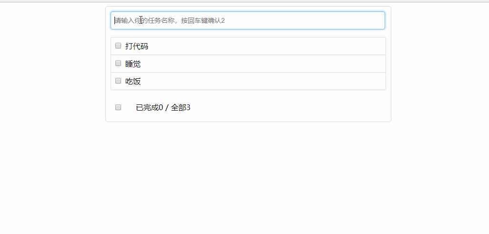

## React应用(基于react脚手架)
### 一、创建项目并启动
* 1. 第一步，全局安装：npm i -g create-react-app, 注意必须全局安装
* 2. 第二步，切换到想创项目的目录，使用命令：create-react-app react_staging （项目名）
* 第三步，进入项目文件夹：cd react_staging
* 第四步，启动项目：npm start(推荐用yarn，我已全局安装yarn)
* yarn start 后浏览器自动打开  显示react模板页面
  
* 默认端口号3000
### 因为是在学习的过程中，所以react_staging中的每一个文件夹都是主要src中代码在项目中运行过，然后放在各自的文件夹中
### 二、脚手架自带文件
* 2.1 文档结构
```js
public ---- 静态资源文件夹
		favicon.ico ------ 网站页签图标
		index.html -------- 主页面
		logo192.png ------- logo图：适用于不同分辨率的手机
		logo512.png ------- logo图
		manifest.json ----- 应用加壳的配置文件
		robots.txt -------- 爬虫协议文件
src ---- 源码文件夹
		App.css -------- App组件的样式
		App.js --------- App组件
		App.test.js ---- 用于给App做测试
		index.css ------ 样式
		index.js ------- 入口文件
		logo.svg ------- logo图
		reportWebVitals.js
			--- 页面性能分析文件(需要web-vitals库的支持)
		setupTests.js
			---- 组件单元测试的文件(需要jest-dom库的支持)
```
* 重要文件
  index.js ---  App.js ---  index.html
* 初学用不到那么多文件会删一些
### 三、第一个react项目
* 把public和src文件删除自己写
  public/index.html  必须有id为root的容器
  public/favicon.ico
  src/index.js    应用入口
  src/APP.js    组件
* 区分组件js和功能js(2种方法)
  一、大写开头是组件，小写开头是功能js
  二、组件后缀jsx，功能后缀js
* 即便是不同组件中的css中类名最好不要一致，因为类名一致先引入的组件样式会被后引入的组件覆盖，此问题可以被less或者样式模块化解决
  样式模块化：
  	在.css文件中加module   Home.moudle.css
	在.jsx文件中用变量接收引入的css  :
	import hello from './Hello.module.css'
	return <h2 className={hello.title}>hello,first react</h2>
* 代码习惯
  第一种：文件名与文件夹一致
	Hello/Hello.module.css
	Hello/Hello.jsx
	Welcome/Welcome.css
	Welcome/Welcome.jsx
	这种写法在App.js中引入组件：
		import Hello from './components/Hello/Hello'
		import Hello from './components/Welcome/Welcome'
   第二种：文件名都改成index
    Hello/index.module.css
	Hello/index.jsx
    Welcome/index.css
	Welcome/index.jsx
	这种写法在App.js中引入组件：
		import Hello from './components/Hello'
		import Hello from './components/Welcome'
### 四、vscode插件: ES7 React/Redux/GraphQL/React-Native snippets
* 代码片段
* 写出代码片段的缩写vscode会提示想要写的代码，选择回车即可
* 省时省力
* 常用
```js
imr→	import React from 'react'
imrd→	import ReactDOM from 'react-dom'
imrc→	import React, { Component } from 'react'
rcc-> 创建并暴露组件
import React, { Component } from 'react'

export default class FileName extends Component {
  render() {
    return <div>$2</div>
  }
}

rfc-> 定义并暴露函数
import React from 'react'

export default function $1() {
  return <div>$0</div>
}

```
### 5、功能界面的组件化编码流程（初学通用）
* 1. 拆分组件: 拆分界面,抽取组件
* 2. 实现静态组件: 使用组件实现静态页面效果
* 3. 实现动态组件
	3.1 动态显示初始化数据
		3.1.1 数据类型
		3.1.2 数据名称
		3.1.2 保存在哪个组件?
	3.2 交互(从绑定事件监听开始)
### 六、组件的组合使用-TodoList 
* 功能: 组件化实现此功能
  1. 显示所有todo列表
  2. 输入文本, 点击按钮显示到列表的首位, 并清除输入的文本
	

